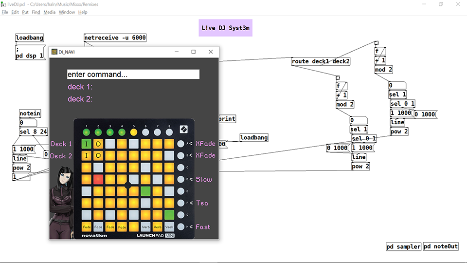

# NAVI_DJ
A simple Novation Launchpad Mini MkI based system for triggering audio live.
Used for playing remixes at gigs. Setup fr 120bpm.
Made whilst binging on *Serial experiments Lain* and *Ergo Proxy*.

## Installation and Use
* Put the pd file in the same folder as your audio files.
* Edit the pdpath.txt file to point to your pd/bin directory

## Python GUI
### Commands
* deck1 load wavefile (omit.wav)
* deck1 play
* deck1 stop
* deck2 load wavefile (omit.wav)
* deck2 play
* deck2 stop
* fx verb (0-1)
* fx delay (0-1)

## Launchpad
* mapped in the gui
* sample triggers
* trigger sample one 16ths before use to manage latency.
